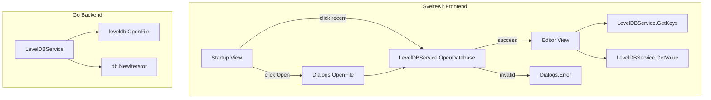

# LevelDB Editor Implementation Plan

## Architecture Overview



## 1. Go Backend: LevelDB Service

Create a new Go service [ldbdbservice.go](ldbdbservice.go) (or similar name) that:

- **Holds state**: Single open DB instance (`*leveldb.DB`). Close previous DB before opening a new one.
- **Methods**:
  - `OpenDatabase(path string) (bool, string)` — Opens the folder as LevelDB. Returns `(true, "")` on success, `(false, errorMessage)` on invalid/corrupted DB. Use `leveldb.OpenFile(path, nil)`; if `err != nil`, return `(false, err.Error())`.
  - `GetKeys() ([]string, error)` — Iterate with `db.NewIterator(nil, nil)`, collect keys, copy to `[]byte` before conversion (iter.Key() is invalid after Next()). Return keys as strings; for non-UTF-8 keys use hex encoding.
  - `GetValue(key string) (string, error)` — Use `db.Get([]byte(key), nil)`. Return value as string; for binary values use hex or base64.
  - `CloseDatabase() error` — Close the open DB.

**Validation**: Attempt `leveldb.OpenFile(path, nil)`; if it returns an error, the folder is not a valid LevelDB database.

Register the service in [main.go](main.go) via `application.NewService(&LevelDBService{})`, then run `wails3 generate bindings -ts` (or use `task dev`) to regenerate frontend bindings.

---

## 2. Startup Screen (Replace Demo UI)

Replace the content in [frontend/src/routes/+page.svelte](frontend/src/routes/+page.svelte):

- **Layout**:
  - Primary button: "Open LevelDB database"
  - Section below: "Recently opened" with a list of recent database paths (clickable).
- **Open flow**:
  - On "Open LevelDB database" click: call `Dialogs.OpenFile({ CanChooseDirectories: true, CanChooseFiles: false, Title: "Select LevelDB Database Folder" })` from `@wailsio/runtime`.
  - The dialog returns a single path (string) or empty if cancelled.
  - If path returned: call `LevelDBService.OpenDatabase(path)`.
- **Validation feedback**:
  - If `OpenDatabase` returns `(false, msg)`: show `Dialogs.Error({ Title: "Invalid Database", Message: msg })`.
  - If success: switch to editor view (see below).
- **Recent databases**:
  - Store list in `localStorage` (e.g. `recent-leveldb-paths`) as JSON array of `{ path, label }`.
  - On successful open: prepend current path to recent list (deduplicate, limit to ~10).
  - On recent item click: call `OpenDatabase(path)`.

---

## 3. Folder Picker Integration

Use Wails runtime `Dialogs.OpenFile` with:

```typescript
import { Dialogs } from "@wailsio/runtime";

const path = await Dialogs.OpenFile({
  CanChooseDirectories: true,
  CanChooseFiles: false,
  Title: "Select LevelDB Database Folder",
});
```

The options match [OpenFileDialogOptions](vendor/github.com/wailsapp/wails/v3/pkg/application/dialogs.go) (`CanChooseDirectories`, `CanChooseFiles`, `Title`). The returned value is the selected directory path (or empty on cancel).

---

## 4. Two-Column Editor View

When a database is successfully opened, show the editor:

- **Left column**: Scrollable list of keys (from `LevelDBService.GetKeys()`). Keys sorted lexicographically (goleveldb iterates in order). Clicking a key selects it.
- **Right column**: Display the value for the selected key (from `LevelDBService.GetValue(key)`).

**Data handling**:

- Keys/values may be binary. For display: try UTF-8 decode; if invalid, show hex-encoded string.
- Implement hex encoding in the Go service when returning non-UTF-8 data.

**View switching**:

- Use reactive state in Svelte: `dbPath`, `keys`, `selectedKey`, `selectedValue`.
- When `dbPath` is set and keys loaded, render editor layout; otherwise render startup view.
- Optional: "Close database" or "Back" to return to startup and call `CloseDatabase()`.

---

## 5. File Changes Summary

| File                                                                 | Action                                                                              |
| -------------------------------------------------------------------- | ----------------------------------------------------------------------------------- |
| New: `ldbdbservice.go`                                               | Create LevelDB service with OpenDatabase, GetKeys, GetValue, CloseDatabase          |
| [main.go](main.go)                                                   | Register `LevelDBService` in `Services`                                             |
| [frontend/src/routes/+page.svelte](frontend/src/routes/+page.svelte) | Replace demo with startup + editor; integrate Dialogs, localStorage, LevelDBService |
| [frontend/static/style.css](frontend/static/style.css)               | Add styles for two-column layout, key list, value panel                             |
| `frontend/bindings/`                                                 | Regenerate via `wails3 generate bindings -ts` (or `task dev`)                       |

---

## 6. UX Details

- **Loading**: Show loading state when calling `OpenDatabase` or `GetKeys`.
- **Empty state**: If `GetKeys()` returns empty, show "No keys" in the left panel.
- **Value display**: Use `<pre>` or monospace for value; handle long values with scroll.
- **Error handling**: Surface `GetKeys`/`GetValue` errors (e.g. if DB was closed externally) via simple error message in UI.

---

## 7. Dependency Notes

- `github.com/syndtr/goleveldb` is already in [go.mod](go.mod).
- `@wailsio/runtime` (Dialogs, Events) is already in frontend.
- No new dependencies required.
