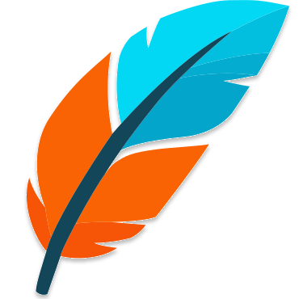

<div align="center">
  <picture>
    
  </picture>
  <h1>LevelDB Editor</h1>

<a href="https://opensource.org/license/agpl-v3"></a>

</div>

## Getting Started

LevelDB Editor is a cross-platform viewer and editor for your LevelDB databases.

Built with Wails v3 and SvelteKit.

## Dev Container

Open this repository in VS Code or Cursor and choose **Reopen in Container**. The dev container installs Go, Node.js, Wails v3, Task, frontend dependencies, and the Linux GTK/WebKit packages needed by Wails.

Use the container terminal as usual:

```bash
task dev
```

If you need to see the Linux desktop window from inside the container, open the forwarded **Desktop preview** port `6080`; the default VNC password is `vscode`.

## Run

```bash
task dev
```

## Build

```bash
task build
```

Binaries end up in `bin/`.
